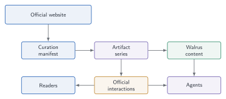

# Building PaperProof with PaperProof: How Our Docs, Prompts, Blog, and Forum Become Protocol Artifacts

Author: PaperProof Labs  
Category: Product and Protocol  
Status: Official Blog Draft  
Suggested Artifact Type: `blog_post`  

The strongest test of an infrastructure protocol is whether it can carry its
own work.

PaperProof is designed for verifiable knowledge artifacts: versioned content,
Walrus-backed storage, Sui-based identity, official comments, official likes,
governance-aware registries, SDKs, and indexer support. Those ideas are useful
only if they become more than diagrams. They should operate inside a real
application, with real documents, real prompts, real updates, and real user
flows.

That is why the official PaperProof website is becoming one of the first users
of PaperProof itself.

Our Docs, Copilot prompts, Blog, and Forum are not planned as ordinary static
website pages forever. They are being shaped as protocol-backed surfaces. The
website can still be fast, readable, and familiar, but the source of truth for
important content can be PaperProof artifacts.

This matters for more than internal consistency. It shows a path for any Sui
and Walrus application that wants to keep a friendly web experience while
placing durable content identity, version state, and official interaction
bindings in public protocol records. PaperProof's own website becomes a
working reference for how a Web2-like experience can be powered by Web3-native
evidence.

## Why self-use matters

Protocols often fail at the gap between abstract correctness and product
reality.

It is easy to say that content should be versioned. It is harder to make a
documentation page load the latest official version from a protocol artifact.
It is easy to say that AI prompts should be auditable. It is harder to make a
Copilot prompt live as a versioned artifact instead of an invisible string in
frontend code. It is easy to say that forums should be decentralized. It is
harder to bind a discussion thread to the artifact it discusses.

By using PaperProof inside the official app, we force the protocol to answer
practical questions:

- How does a static app know which document to load?
- How does it resolve the latest version?
- How does it verify content references?
- How does it avoid loading every document at startup?
- How does it show artifact codes and version IDs without overwhelming users?
- How does Copilot know its own official prompt?
- How does memory remain optional and private while still having governed
  discovery metadata?
- How does Blog or Forum content become updatable without redeploying the
  whole site?

These are not side issues. They are the difference between a protocol demo and
a usable knowledge system.

## Docs as official PaperProof artifacts

The official Docs are the most direct example.

Instead of treating documentation as only bundled website text, the Docs
structure can map each first-level and second-level entry to a PaperProof
artifact series. The navigation manifest tells the app which official document
series belongs to each page. When a user opens a document, the app resolves the
latest version, downloads the Markdown body from Walrus, renders it, and shows
the artifact reference at the bottom.

This gives the Docs a useful balance:

- the website remains easy to browse;
- navigation loads quickly;
- individual documents are loaded lazily;
- each document can be updated by publishing a new PaperProof version;
- historical versions remain inspectable;
- the page can display artifact code, series ID, latest version ID, and content
  hash when appropriate.

Lazy loading is important. A serious documentation set may include dozens of
articles. The website should not fetch every Sui object and every Walrus blob
when a user first enters Docs. It should load the index first and fetch
document bodies on demand.

The technical pattern is simple and reusable: a manifest gives the app a small
navigation map, Sui gives each document a series and latest-version state, and
Walrus provides the Markdown body. The app combines them at runtime. That means
official content can be updated by adding artifact versions, while the frontend
can remain stable.

That pattern is exactly what many future PaperProof applications will need:
small manifests for navigation, protocol artifacts for authority, and
on-demand content resolution for performance.

## What this proves about Sui and Walrus

PaperProof's official surfaces are a practical demonstration of why Sui and
Walrus work well together.

Sui is not only used as a payment rail. It stores the structured object graph:
artifact series, typed versions, official interaction objects, governance
registries, prompt route bindings, and memory capability entries. These are
stateful relationships that benefit from Sui's object model and event stream.

Walrus is not only used as generic file hosting. It stores the content bodies
that should not live directly on chain: Markdown documents, blog packages,
assets, prompt packages, reports, and other blobs. PaperProof ties those blobs
to artifact versions with hashes and references, so a reader or agent can
resolve content without treating a raw URL as the entire source of truth.

Together, they create an application pattern with three layers:

- user-facing website for speed and usability;
- Sui objects and events for identity, state, and verification;
- Walrus blobs for durable content payloads.

| Runtime layer | PaperProof use today | What can change by version update | What stays stable |
|---|---|---|---|
| Website shell | Navigation, rendering, wallet UX, Copilot UI | Manifest entries and resolved artifact content | User-facing routes and interaction model |
| Artifact series | Docs pages, Blog posts, prompt packages, Forum topics | Latest version pointer and metadata | Series ID, artifact code, official bindings |
| Walrus payloads | Markdown bodies, packages, diagrams, assets | Content bytes for each new version | Hash-checked content references |
| Sui objects | Versions, comments, likes, prompt and memory registries | Official state transitions and events | Protocol identity and audit trail |
| Indexer/API | Lists, query views, rendered content cache | Cached projections after new events | Rebuildability from canonical sources |

That pattern is relevant to many ecosystem applications, not only PaperProof.

## Prompts as protocol-native content

AI prompts are part of application behavior.

In many apps, prompts are hidden inside source files, deployment bundles, or
backend services. Users may never know when they change. Developers may not be
able to audit old versions. Agents may behave differently after an update
without leaving a clear public trail.

PaperProof's official Copilot prompts follow a different path. They can be
stored as PaperProof `generic_file` artifacts using a prompt package format.
The native prompt registry binds an app route or capability to a prompt series.
The app resolves the official prompt, validates the package, and injects it
into Copilot.

This creates a simple but powerful property:

> Official prompts become traceable, versioned, auditable, and replaceable.

The website can still have fallback prompts bundled in code for resilience, but
the preferred path is protocol-native. If the prompt for the global Copilot or
memory descriptor changes, the new version can become a PaperProof artifact
rather than a silent frontend edit.

For users, this means Copilot explanations can improve. For auditors, it means
prompt history can be inspected. For builders, it demonstrates a general
pattern for agentic applications: important prompts deserve artifact identity.

## Agent memory as a governed capability

PaperProof Copilot memory is optional, wallet-linked, and app-scoped. It is
designed to remember modest context such as preferred language, answer style,
recent focus topics, and ongoing task summaries.

The official implementation separates private memory from public registry
metadata:

- private memory content is handled through MemWal;
- the Sui memory registry records governed discovery and availability metadata;
- each wallet and app can have at most one active official memory entry;
- deleting memory tombstones the chain-side registry entry without deleting
  external MemWal or Walrus data;
- the browser controls local Enable, Disable, Access, and Revoke behavior.

This is another example of PaperProof using its own philosophy. The protocol
does not need to store private memory text on chain. It needs to record the
official capability entry, its availability, version references, and lifecycle
state in a way the app can reason about.

The result is a memory layer that is useful for users and legible for the
protocol.

## Blog as verifiable official narrative

The official Blog is the natural next step after Docs.

A blog post can be represented as a `blog_post` artifact. Its Markdown body and
assets can live in Walrus. The chain records the series, typed version,
metadata, content hash, content references, and official interaction objects.
A lightweight manifest can curate which posts appear on the official Blog
homepage, in what order, and under which categories.

This means an official Blog post can have:

- a stable artifact code;
- a version history;
- a latest version;
- a content hash;
- a Walrus-backed body;
- an official comments tree;
- official likes and dislikes;
- a curated position in the official website.

That matters because official project writing is not disposable. Roadmap
notes, protocol essays, release explanations, design decisions, and governance
updates may later become references for users, reviewers, developers, and
agents. They should not be trapped as unversioned website fragments.

The Blog can also help ordinary users. It can explain the protocol in a more
narrative voice than Docs. Docs answer "how does this work?" Blog answers
"why does this matter now?"

For the ecosystem, Blog is also a proof of value. Official project writing is
often where roadmaps, design tradeoffs, release reasoning, and community
positioning live. If those posts are versioned PaperProof artifacts, they can
be cited, updated, discussed, and indexed without becoming detached from their
history.

## Forum as artifact-backed discussion

Forums are where protocol infrastructure meets community reality.

A forum topic can be modeled as a PaperProof artifact. The topic body is the
artifact content. The official comment tree becomes the reply thread. Likes and
dislikes provide lightweight feedback. Categories and pinned lists can be
handled by a manifest or indexer view.

This design avoids a common confusion: the forum topic is not merely a row in a
centralized database. It can be a protocol artifact with its own identity,
versioning, and official interaction bindings.

For users, the experience should still look familiar:

- browse categories;
- open a topic;
- read the topic body;
- reply in a comment tree;
- like or dislike;
- inspect the artifact code if needed.

For developers and indexers, the structure is more powerful. They can
differentiate official comment trees from arbitrary discussions. They can
replay events. They can build alternative clients. They can use the same
artifact model that powers Docs and Blog.

For AI agents, the structure is also valuable. A forum topic is no longer just
a web page to scrape. It is a versioned artifact with an official discussion
tree. An agent can summarize the topic, distinguish the topic body from
comments, cite the artifact, and reason about whether a thread is official.

## Manifest is curation, not source of truth

The official website may use manifests for Docs navigation, Blog ordering,
Forum sections, pinned posts, and route mappings. This is a practical interface
layer. Users need coherent navigation. Editors need control over what appears
first. Apps need a compact index.

But the manifest should not become the source of truth for the content itself.

The artifact series is the durable identity. The latest version is protocol
state. The content is referenced through Walrus and hashes. The manifest
curates presentation and navigation.

This separation is important. It allows the official app to change layout,
feature certain posts, rename sections, or hide unsafe content without
rewriting the underlying artifact history. It also allows independent apps to
build their own navigation using the same artifacts.

## Version updates without redeploying the whole app

One of the most practical benefits of protocol-backed content is update
discipline.

If a Docs article, Blog post, or prompt needs an update, the project can publish
a new artifact version. The official app can resolve the latest version at
runtime. In some cases, a manifest update may be needed to add a new page or
change ordering. In other cases, the existing series ID remains stable and only
the latest version changes.

This gives PaperProof content a healthier lifecycle:

- publish initial version;
- update by adding a new version;
- keep previous versions available;
- expose latest content to users;
- preserve evidence for auditors and agents.

It also reduces the pressure to redeploy the website for every content change.
The interface can be stable while the knowledge evolves.

## A better story for AI agents

When Copilot answers questions about PaperProof, it should not rely only on a
static prompt and whatever page text happens to be bundled into the app.

A protocol-backed website lets Copilot reason from richer context:

- official Docs loaded from PaperProof artifacts;
- official prompts loaded from prompt artifacts;
- optional wallet-linked memory;
- Blog posts as verifiable narrative artifacts;
- Forum topics and comments as artifact-bound discussions;
- artifact codes, version IDs, and content hashes available when needed.

This gives AI a better grounding surface. It also lets users ask better
questions:

- "Which version of this document are you using?"
- "Is this an official prompt?"
- "What does this memory feature store?"
- "Where is this Blog post registered?"
- "Does this forum topic have an official comment tree?"

In an agentic application, that kind of inspectability is not a luxury. It is
part of trust.

## What this means for PaperProof's official website

The official website is becoming a layered application:

- a TypeScript static frontend;
- Sui and Walrus as protocol and storage layers;
- PaperProof artifacts as content identity;
- native prompt registry for Copilot behavior;
- memory registry plus MemWal for optional Agent Memory;
- comments and likes for interaction;
- SDKs and indexers for developer access;
- manifests for official navigation and curation.

| Official surface | Protocol-backed source | User-facing benefit |
|---|---|---|
| Docs | Generic-file artifact series with Markdown bodies | Documentation can update through versions without losing history |
| Blog | `blog_post` artifacts with Markdown packages and assets | Essays become citeable, inspectable, and discussable |
| Forum | Topic artifacts plus official comments trees | Discussion is bound to a verifiable topic record |
| Copilot | Generic-file prompt artifacts plus the route registry | Agent behavior can be updated and inspected |
| Memory | Sui memory entries plus private MemWal content | Continuity stays scoped, optional, and wallet-linked |

The app can be deployed through ordinary web infrastructure for reliability,
while the important content and protocol state remain verifiable through Sui
and Walrus.

This is a pragmatic architecture. It does not confuse decentralization with
making every web request hard. It uses public cloud, static delivery, and
backend proxies where they improve reliability, while keeping artifact identity
and content commitments in the protocol.

## Why this matters beyond PaperProof

If PaperProof can use PaperProof for its own Docs, prompts, Blog, Forum, and
memory capability, other projects can use the same pattern.

A research group could publish papers, reports, datasets, and lab notes. An
open-source project could publish releases, audit reports, changelogs, and
governance proposals. A DAO could publish official statements and discussion
threads. An agent platform could publish prompts, memory descriptors, and
agent-generated reports with version histories.

The important point is not that every project should copy the PaperProof
website. The important point is that the artifact model is reusable.

This is also a growth path. A protocol that starts with Docs and Blog can later
support independent applications: research portals, grant reporting systems,
developer knowledge bases, agent collaboration workspaces, and community
forums. Each new app adds more artifact demand, more Walrus content, more Sui
object activity, and more useful data for indexers and agents.

## Closing

PaperProof is not only a protocol we describe. It is a protocol we are putting
to work.

Docs become official artifacts. Prompts become protocol-native content. Agent
memory becomes a governed capability with private storage. Blog posts become
verifiable narrative records. Forum topics become artifact-backed discussions.

This self-use is not a gimmick. It is how we test whether PaperProof can carry
real knowledge, real updates, real interactions, and real agent context.

The long-term ambition is clear: important digital work should not be trapped
inside fragile pages and invisible application state. It should have durable
identity, version history, content references, and interaction bindings that
humans and agents can verify.

PaperProof is building that layer by using it.
