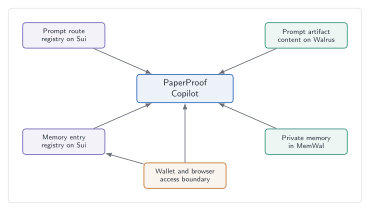

# Why Verifiable Prompts and Agent Memory Matter

Author: PaperProof Labs  
Category: Agentic Web  
Status: Official Blog Draft  
Suggested Artifact Type: `blog_post`  

AI applications are no longer only interfaces. They are becoming operational
systems for knowledge work.

A Copilot can explain a protocol, guide a publishing flow, summarize a
document, remember a user's preferred answer style, and help navigate complex
Web3 actions. In that environment, two pieces of application behavior become
especially important:

- the prompt that guides the agent;
- the memory that gives the agent continuity.

Most applications treat both as implementation details. PaperProof treats them
as first-class protocol-adjacent capabilities.

This post explains why verifiable prompts and wallet-linked Agent Memory matter
for users, developers, auditors, and the agentic web.

The deeper point is that prompts and memory are becoming part of internet
infrastructure. If agents help users navigate protocols, publish content,
answer questions, or interpret governance state, then agent context should not
be an untraceable side channel. PaperProof connects prompts, memory, Sui
objects, Walrus content, and application policy into one inspectable model.

## Prompts are application logic

A prompt is not just text.

It may define the assistant's role, safety boundaries, project knowledge,
allowed claims, user guidance, and explanation style. It may instruct the agent
how to describe wallet signing, how to handle private keys, how to distinguish
Sui from Walrus, how to explain artifact versions, or how to avoid overstating
what the protocol proves.

When a prompt changes, application behavior changes.

That is why important prompts should not be invisible. If a Web3 application
uses an AI assistant to guide users through protocol actions, users and
builders should be able to ask:

- Which official prompt is being used?
- When was it updated?
- Is it tied to this application route?
- Can the latest version be replaced without losing history?
- Can auditors compare earlier and current prompts?

PaperProof's answer is protocol-native prompts.

## What protocol-native prompts mean

In the official PaperProof app, prompts can be packaged as PaperProof
artifacts. The prompt registry maps an app route or capability to an official
prompt artifact series. The app resolves the latest version, downloads the
prompt package, validates it, and uses the prompt in Copilot.

The resulting property is simple:

> Official prompts are traceable, versioned, auditable, and replaceable.

This does not mean every experimental prompt in the world needs to be on chain.
It means prompts that define official application behavior should have a better
record than "whatever string was bundled in the latest frontend build."

For PaperProof, this includes at least:

- the global Copilot prompt;
- page-specific guidance;
- the Copilot Memory descriptor prompt;
- future prompts for Blog, Forum, Docs, publishing, governance, and developer
  workflows.

Under the hood, this uses the same PaperProof pattern as other content. The
prompt package can be stored through Walrus, while Sui records the artifact
series, version, content references, and route binding in the prompt registry.
The app can resolve `latest` by protocol state instead of hardcoding one
opaque prompt forever.

That is important for the Sui and Walrus ecosystems because it turns AI
application behavior into a real use case for decentralized storage and
object-centric state. Walrus stores the prompt content. Sui records which
prompt is official for which route. PaperProof makes the two useful together.

## Why versioning prompts matters

Prompt versioning is useful for both safety and iteration.

AI applications improve over time. A prompt may need clearer safety language,
better technical explanations, new references to deployed contracts, or better
instructions for explaining a feature. Without versioning, those changes are
hard to review. With PaperProof artifacts, each prompt update can become a new
version of the same series.

This gives the application a healthier update path:

1. Publish an initial prompt package.
2. Register it for the relevant app route.
3. Update behavior by publishing a new version.
4. Let the app resolve the latest official version.
5. Preserve old versions for inspection.

That pattern makes prompts more like maintained protocol content and less like
hidden magic.

This also creates a new category of artifact: operational AI content. A prompt
is not only documentation and not only code. It is a behavioral instruction
package. PaperProof gives that package an identity, a latest version, and a
history that can be inspected by users, developers, or governance processes.

| AI context element | PaperProof representation | Why it should be explicit |
|---|---|---|
| Public knowledge | Versioned artifact content | Agents can cite a stable series and version |
| Official prompt | Prompt package artifact plus route registry entry | Agent behavior can be audited and updated |
| Private memory | Wallet-linked MemWal content | User continuity stays scoped and off chain |
| Memory capability | Sui memory registry entry | Apps can check lifecycle and availability |
| Local access | Browser-controlled delegate or wallet approval | Users keep control of when memory is used |

## Memory is continuity, but continuity needs boundaries

Agent memory is powerful because it lets a Copilot feel less repetitive.

A user may prefer Chinese answers, concise reasoning, strong judgment, or a
particular technical depth. A user may be working on a publishing task, testing
Agent Memory, preparing a hackathon submission, or comparing SDK behavior. A
small amount of remembered context can make the assistant more useful across
sessions.

But memory also creates risk. Users need to know what is remembered, how it is
used, whether it is optional, and how to disable or delete the official entry.
Applications should avoid turning memory into an opaque data sink.

PaperProof's Agent Memory design takes a bounded approach.

## What PaperProof Agent Memory stores

The intended memory content is practical and limited:

- preferred language;
- preferred answer style;
- recent focus topics;
- ongoing task summary.

This is not designed as a general personal archive. It is a lightweight memory
layer for making Copilot more helpful inside the PaperProof app.

The official app uses a wallet-linked, app-scoped memory identity. The default
app ID is `paperproof-app`, the namespace root is `paperproof/copilot`, and the
memory ID is `copilot/profile`.

Ordinary users should not need to configure these values. The app should hide
them behind simple controls.

## The four user controls

The official app presents four basic Agent Memory actions:

| Control | Meaning |
|---|---|
| `Enable` / `Disable` | Locally allow or pause memory use in Copilot answers |
| `Create` / `Delete` | Register or tombstone the official on-chain memory entry |
| `Update` | Save the latest relevant memory through MemWal |
| `Access` / `Revoke` | Authorize or remove this browser's memory access |

These controls intentionally affect different layers.

`Enable` and `Disable` are local browser choices. They do not change chain
state. A user can temporarily pause memory recall without deleting anything.

`Create` and `Delete` affect the Sui memory registry. Creating memory registers
the official capability entry for the connected wallet and app. Deleting
tombstones the chain-side entry and releases the active slot. It does not
delete external MemWal records or Walrus blobs.

`Update` saves memory content through MemWal after official usability checks
pass.

`Access` and `Revoke` handle this browser's local access. The app can authorize
memory access for the connected wallet and store a local delegate key. If the
user changes browser or computer, they can authorize again with the same
wallet.

## Why the chain registry exists

One might ask: if private memory is in MemWal, why does PaperProof need a Sui
memory registry at all?

The registry is not for storing private memory text. It is for governed
discovery and lifecycle state.

The registry helps the official app answer questions such as:

- Does this wallet have an active official memory entry for this app?
- Which provider and namespace does the entry use?
- Which descriptor prompt series explains the memory capability?
- Is this entry officially available for use?
- Has the owner deleted or disabled the entry?
- Is there at most one active entry for this wallet and app?

That last point is important. The official registry enforces one active memory
entry per wallet and app. This avoids ambiguity in the user experience. If a
user deletes an entry, they can create a new one later.

## Privacy model

PaperProof Agent Memory separates public and private concerns.

Public or chain-side registry data is about capability discovery and official
availability. It may include provider information, app ID, namespace root,
descriptor references, owner state, and entry state.

Private memory content remains in MemWal. The official app should treat memory
as helpful context, not as instructions that override the user's current
request or the system's safety boundaries. Copilot should not reveal private
memory unless the user asks about it.

This design is not a promise that every possible integration is private by
default. It is the intended architecture for the official PaperProof app:
minimal chain metadata, private memory content off chain, local browser control
for access and enablement, and clear user actions.

| Layer | Public or private | Role |
|---|---|---|
| Prompt route registry | Public Sui state | Binds an app route to an official generic-file prompt series |
| Prompt artifact content | Public Walrus content | Stores versioned instructions for official agent behavior |
| Memory entry registry | Public Sui state | Records owner, app scope, descriptor reference, availability, and lifecycle |
| Private memory | Private MemWal content | Stores user-specific preferences and task context |
| Wallet and browser access | User-controlled signing and local access boundary | Approves registry actions and controls the local delegate key |

## Governance and availability

PaperProof's prompt and memory registries are lightweight, but they still need
management boundaries.

The memory registry can support official availability checks. If an entry or
capability is marked unavailable for official use, the official Copilot should
not use that memory. This gives PaperProof a way to handle policy,
compatibility, or safety issues without pretending that private content should
be managed on chain.

Similarly, the prompt registry should not allow arbitrary addresses to rewrite
official prompt routes. It is connected to the same general philosophy as the
rest of the protocol: public functions are not enough; official state needs
official authority paths.

## Why this matters for ordinary users

For ordinary users, the ideal experience is simple.

They connect a wallet, authorize memory access, create an Agent Memory entry,
enable memory, and ask Copilot to remember useful preferences. They do not need
to understand descriptor series IDs, namespace roots, delegate keys, object IDs,
or registry internals.

The payoff is continuity:

- Copilot can remember language preference.
- Copilot can answer in the preferred style.
- Copilot can maintain context around recent tasks.
- The user can disable memory locally.
- The user can delete the official chain-side entry when they want to reset the
  official capability.

This makes AI feel more helpful without making it feel uncontrolled.

## Why this matters for Web3 users

For Web3 users, PaperProof shows how agent UX can be made more transparent.

Many Web3 apps will add AI assistants. Those assistants will explain
transactions, surface risks, summarize governance proposals, and help users
navigate protocols. If their prompts and memory behavior are invisible, users
will be asked to trust a black box layered on top of another complex system.

PaperProof's pattern is different:

- prompts can be protocol-native artifacts;
- memory capability can be registered on chain;
- private memory content can remain off chain;
- official availability can be governed;
- users keep wallet signing in the wallet;
- the app can explain exactly which controls affect local state, chain state,
  and memory state.

That is a healthier foundation for AI-assisted Web3 interfaces.

## Why this matters for developers and auditors

Developers need stable integration points. Auditors need evidence trails.

Prompt artifacts and memory registries make it easier to answer questions that
would otherwise require digging through deployment bundles or private backend
state. SDKs can expose registry reads. Indexers can observe events. Apps can
validate official package IDs and object bindings.

This does not eliminate the need for code review or operational security. But
it gives the AI layer a protocol-aware structure instead of leaving it as
untracked application behavior.

## The broader agentic web pattern

PaperProof's prompt and memory design points toward a broader pattern:

- public, shared knowledge should be artifact-based and versioned;
- prompts that shape official agent behavior should be traceable;
- private user memory should remain private and bounded;
- capability registries should expose enough metadata for apps to reason about
  availability and lifecycle;
- users should control local enablement and access;
- agents should treat memory as context, not authority.

This pattern can apply beyond PaperProof. Documentation assistants, research
agents, DAO copilots, educational agents, developer bots, and autonomous
workflows all need better boundaries between public knowledge, official
prompts, private memory, and user control.

## What this could enable next

Prompt and memory infrastructure can grow into several application categories:

- Project copilots that explain official Docs, Blog posts, governance proposals,
  and release notes using versioned source artifacts.
- Research agents that cite PaperProof artifact versions instead of unstable
  web pages.
- DAO assistants that separate official proposal records from discussion
  summaries and personal preferences.
- Developer agents that remember local preferences while loading official SDK
  and deployment references from protocol artifacts.
- Multi-agent workflows where task reports, prompt policies, and output
  artifacts can be published, versioned, and reviewed.

This is why PaperProof's Agent Memory is intentionally modest today. The first
step is not to promise a universal personal memory vault. The first step is to
establish the pattern: scoped memory, verifiable prompts, official capability
registries, private content boundaries, and chain-visible lifecycle state.

Once that pattern is stable, richer agentic applications can build on it.

## Closing

Verifiable prompts and Agent Memory are not decorative features. They are part
of the trust model for AI-native applications.

PaperProof makes prompts versioned artifacts. It makes memory a wallet-linked,
app-scoped capability with governed discovery and private storage. It gives
users simple controls while preserving deeper evidence for builders and
auditors.

As AI becomes a normal interface to Web3 and knowledge systems, that structure
will matter. The question will not only be "what did the agent answer?" It will
also be "which prompt guided it, which context did it use, and who controlled
that capability?"

PaperProof is building toward an agentic web where those questions can have
clear answers.
